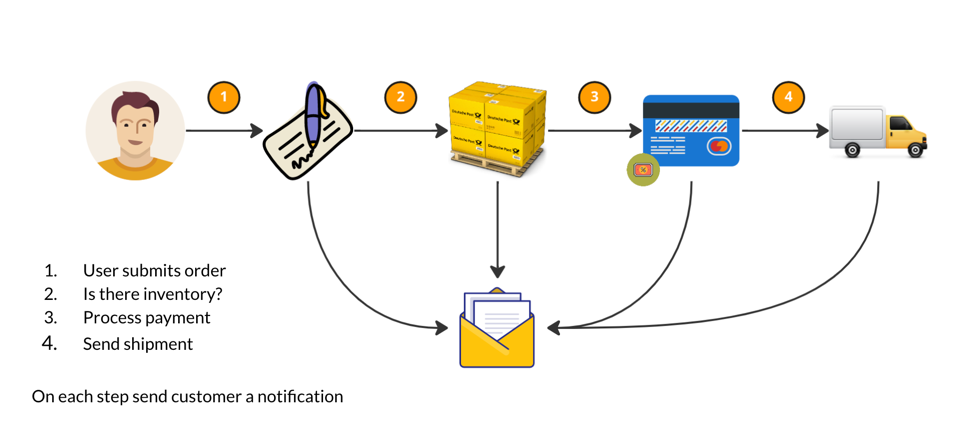
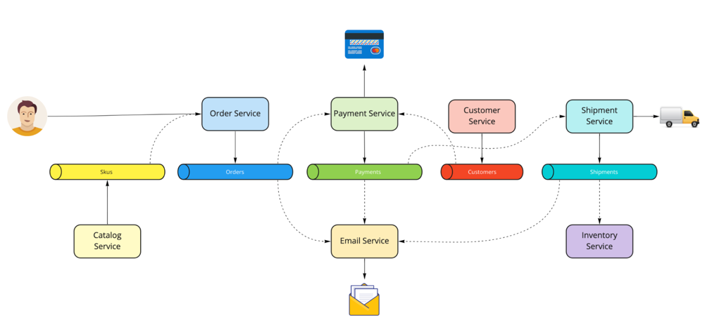

# Event-Driven Demo

This is a demo application for an Order Management Service. Below is the flow of the application, as well as a high-level architecture.

## Prerequisites

- Docker
- Gradle
- JDK 17

## Running and testing

### Running

To run all the services locally, run `make up`. `make down` spins the services down.

### Testing

#### Unit and service tests
To run the unit and service tests, run `make service-tests`

### End-to-end tests
`make e2e-tests` - this will spin up all the services beforehand. To run e2e tests against an already running environment, run `make run-e2e`.